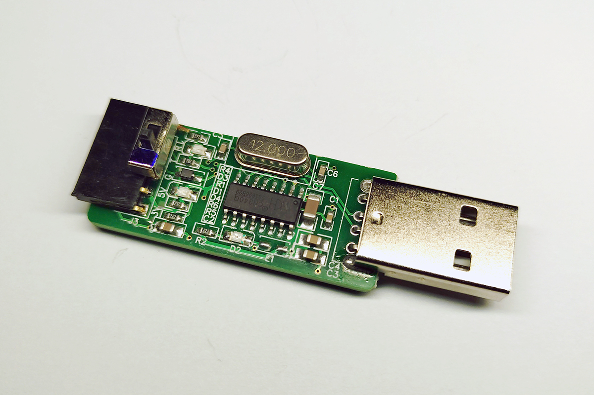
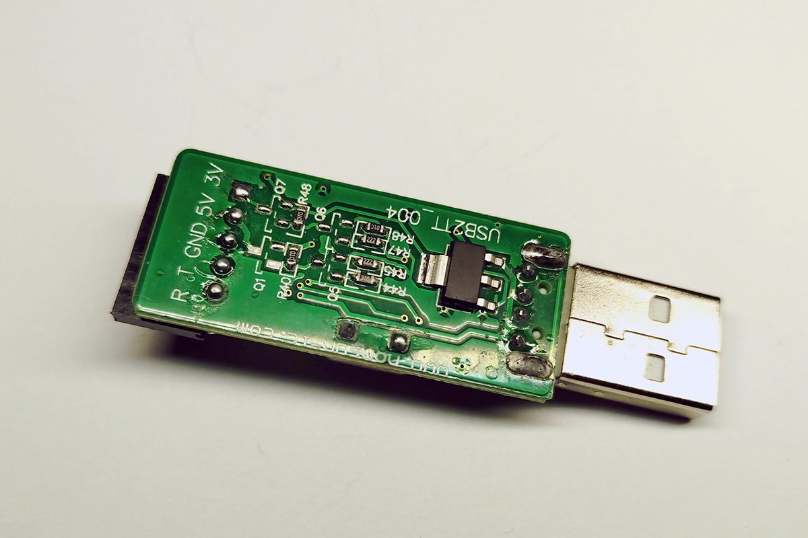
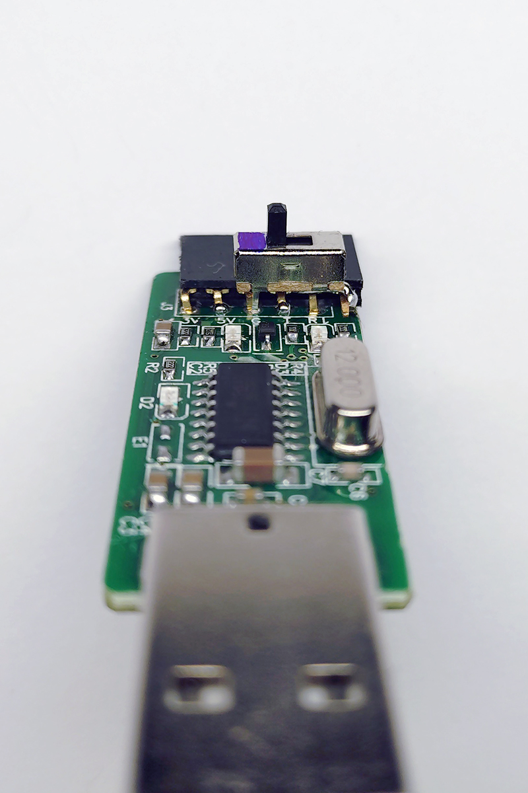
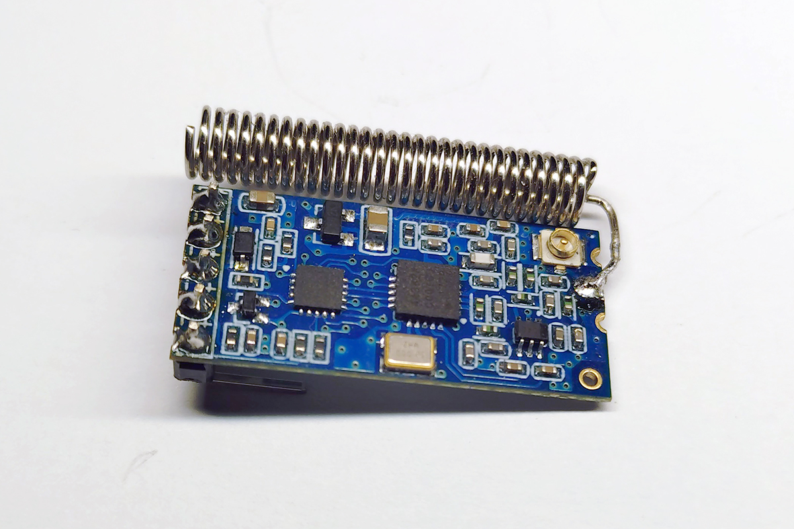
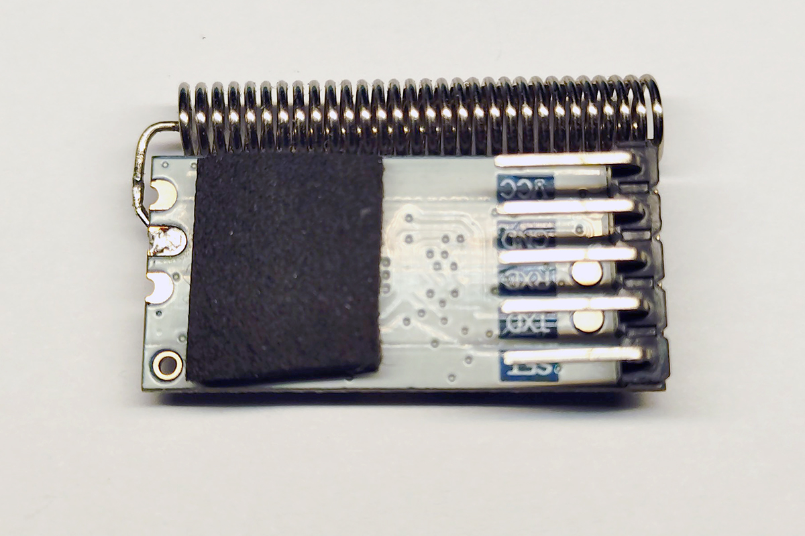
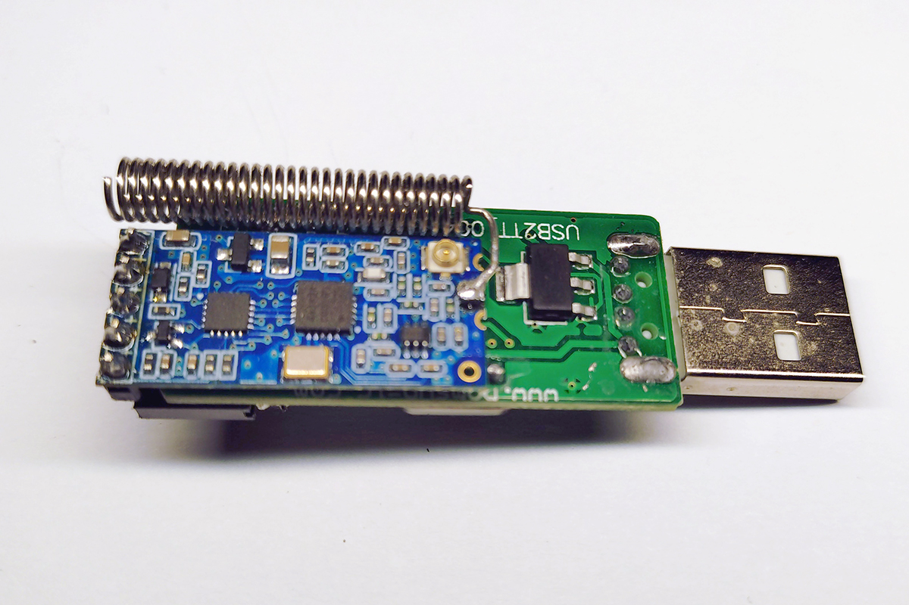
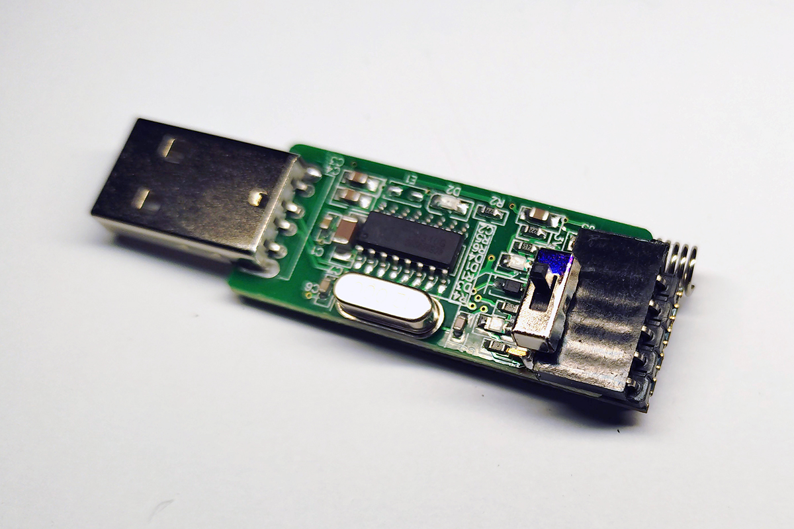
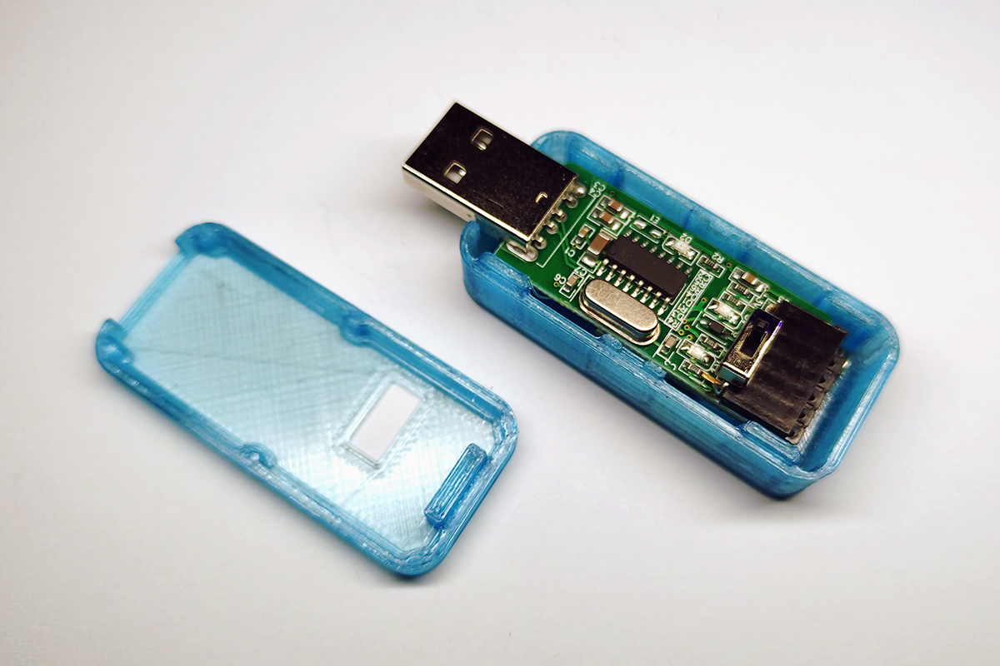
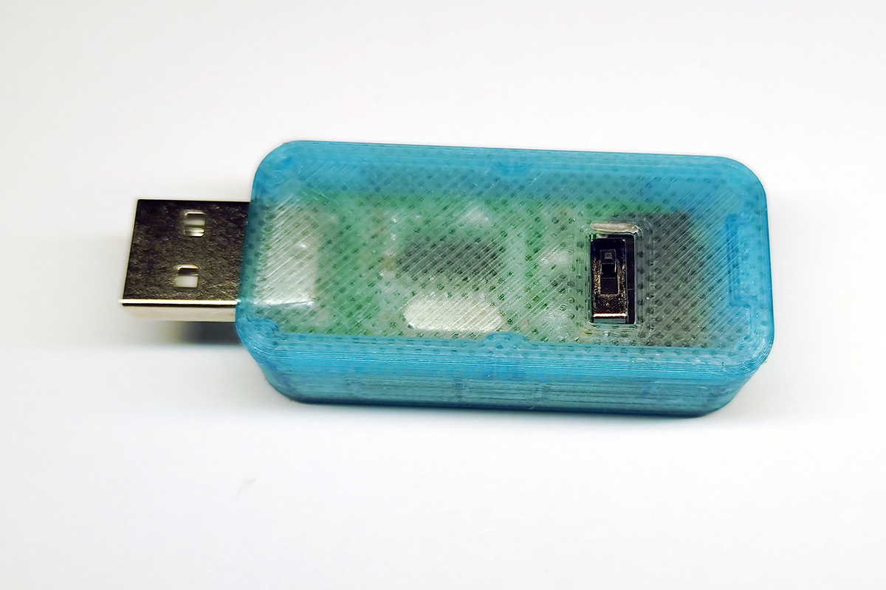

# HC-12 USB-Stick

### Parts List
These are just examples for procurement.
I haven't found the USB to Serial Adapter anywhere else

- [AZ-Delivery: USB to Serial Adapter with CH340](https://www.az-delivery.de/en/products/usb-auf-seriell-adapter-mit-ch340)
- [Funduino: HC-12, SI4438- 433MHz radio module - range up to 1000 meters](https://funduinoshop.com/en/electronic-modules/wireless-iot/radio-technology/hc-12-si4438-433mhz-radio-module-range-up-to-1000-meters)

### Description

The microswitch is required for programming.
This switch connects GND to the EN pin

The [*.stl files](3D-Print/DCC%20HC12%20Case.7z) are included for the housing
 

### Images

   
   
   
   
   
   
   
   
   

