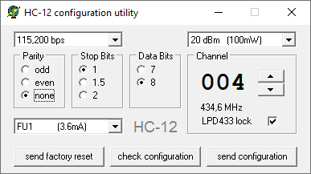
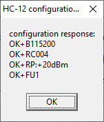

# Serial radio module HC-12  

### My Settings

   
   

### Web Links HC-12
- [HC-12 Funkmodul &#8226; Wolles Elektronikkiste](https://wolles-elektronikkiste.de/hc-12-funkmodul)
- [Jetzt hat es endlich gefunkt! (433MHz Modul HC-12) - [Teil 1]](https://www.az-delivery.de/blogs/azdelivery-blog-fur-arduino-und-raspberry-pi/jetzt-hat-es-endlich-gefunkt-433mhz-modul-hc-12-teil-1)
- [Jetzt hat es endlich gefunkt! (433MHz Modul HC-12) - [Teil 2]](https://www.az-delivery.de/blogs/azdelivery-blog-fur-arduino-und-raspberry-pi/jetzt-hat-es-endlich-gefunkt-433mhz-modul-hc-12-teil-2)

